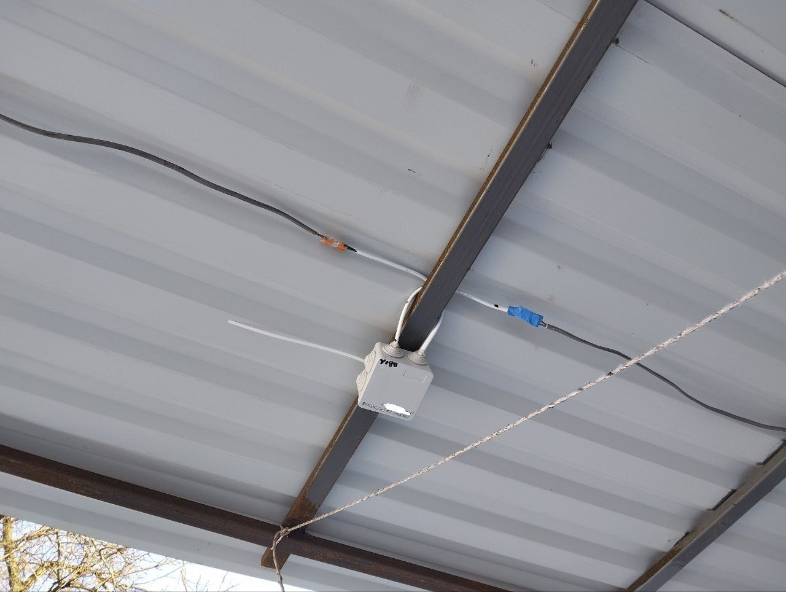
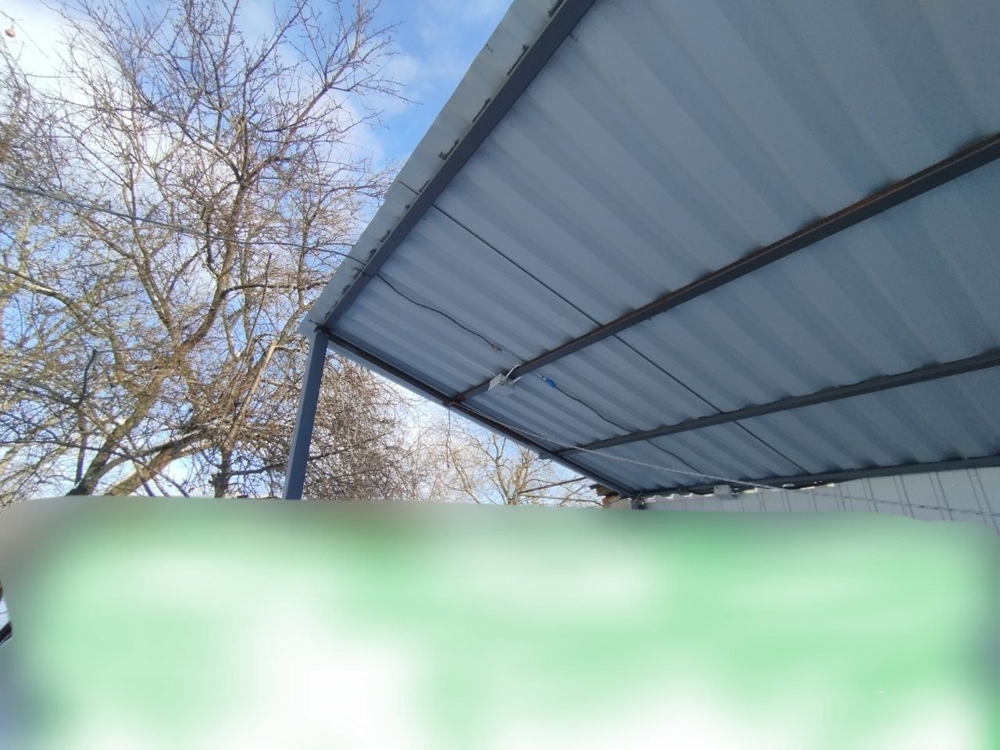

# Base-ESP01-Relay-Vx.x


[Official Page](https://udfsoft.com/?utm_source=Github-Base-Smart-Relay) 

[Device Management Page](https://smart.udfsoft.com/devices/?utm_source=Github-Base-Smart-Relay)

**Base Smart Relay** is a firmware for ESP8266 (ESP-01 / ESP-01S) that provides remote relay and GPIO control via an HTTPS API.

The device periodically polls a backend server, receives commands through HTTP headers, executes them locally, and sends the execution result back to the server.

The project is designed for minimal firmware size, stable operation, and easy backend integration.

------------------------

## 🚀 Features

* 🔌 GPIO control (ON / OFF)
* 📡 HTTPS server polling with configurable interval
* 🔄 Dynamic pollInterval provided by the server
* 📤 Command execution status reporting
* ♻ Device reboot support (REBOOT / HARDRESET)
* 🌐 WiFi configuration via WiFiManager
* 🔐 Authentication using API_KEY and DEVICE_ID
* 🧠 No JSON usage (HTTP headers only → minimal RAM/Flash footprint)

------------------------

## 🧠 Architecture
**Workflow overview**

1. ESP connects to WiFi (WiFiManager)
2. Periodically sends a GET request to the server
3. Server responds with HTTP headers
4. Device:
  * parses the command
  * executes it
  * sends the result via a POST request

```
ESP8266 → GET /devices/commands
        ← X-CMD, X-CMD-PARAM, X-POLL-INTERVAL

ESP8266 → POST /devices/commands/{CMD}
        → X-CMD-STATUS
```

------------------------

## 📡 Supported Commands

| Command     | Description       |
| ----------- | ----------------- |
| `ON`        | Turn GPIO ON      |
| `OFF`       | Turn GPIO OFF     |
| `STATUS`    | Read GPIO state   |
| `REBOOT`    | Reboot device     |
| `HARDRESET` | Hard reset device |


Commands are defined in ```commands.h.```

------------------------

## 🧩 Project Structure
```bash
Base-Smart-Relay/
├── Base-Smart-Relay.ino   # Main device logic
├── commands.h             # Command interface
├── commands.cpp           # Command implementations
├── network_utils.h/.cpp   # HTTPS, headers, callbacks
├── string_utils.h/.cpp    # String utilities
├── config.h.example       # Configuration template
└── README.md
```

------------------------


## ⚙ Configuration

Create your own ```config.h``` file (do not commit it to git):
```cpp
#pragma once

#define DEVICE_ID "xxxx-xxxx-xxxx-xxxx"
#define API_KEY   "xxxxxxxxxxxxxxxxxxx"
#define APP_VERSION "2"
```

```DEVICE_ID``` and ```API_KEY``` are issued by the backend
📩 support@udfsoft.com

------------------------

## 🌐 HTTP API
**GET — Fetch command**
```bash
GET https://smart.udfsoft.com/api/v1/devices/commands
```

Response headers example:
```
X-CMD: ON
X-CMD-PARAM: 2
X-POLL-INTERVAL: 10000
```

**POST — Send command result**
POST https://smart.udfsoft.com/api/v1/devices/commands/{CMD}


Headers:
```
X-CMD-STATUS: OK
X-CMD-PARAM: 2
```

------------------------

## 🛠 Requirements

* ESP8266 (ESP-01 / ESP-01S)
* Arduino IDE / PlatformIO
* Libraries:
  * ```ESP8266WiFi```
  * ```ESP8266HTTPClient```
  * ```WiFiManager```

------------------------

## ⚠ Implementation Notes

* ❌ No JSON parsing → minimal Flash/RAM usage
* ✅ All data exchanged via HTTP headers
* 🔒 HTTPS (WiFiClientSecure, setInsecure())
* ♻ Single HTTPClient instance with proper http.end()
* ⏱ Non-blocking behavior (yield())

------------------------

## 🧪 Suitable For

* Smart relays
* IoT devices
* Smart home systems
* Remote power control
* Backend-driven embedded devices

------------------------

## Supported Relays

### ESP-01s Relay V1.0


------------------------

## Photos





------------------------

## 📄 License

Apache License 2.0
© 2025 [UDFSoft](https://udfsoft.com/?utm_source=Github-Base-Smart-Relay)

